# Stylow Restful API

# CUSTOMER

## 1. Customer Authentication

### 1.1. Registration

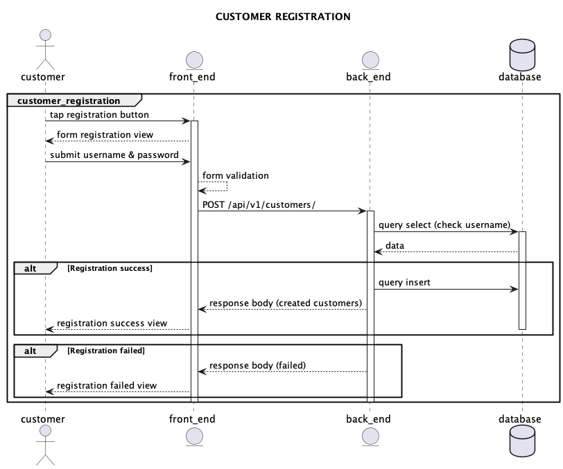

#### Endpoint: POST /api/v1/customers/

#### Request Header: None

#### Request Body:

```json
{
  "username": "Muhammad Veiron Ramadhan",
  "password": "Pass123*"
}
```

#### Response Body:

```json
{
  "status": true,
  "message": "Registration success",
  "username": "Muhammad Veiron Ramadhan"
}
```

#### Query (check username):

```sql
SELECT COUNT(*) AS cnt
FROM customers
WHERE username = ?;
```

### Query (insert username & password)

```sql
INSERT INTO customers (username, password_hash)
VALUES (?, ?);
```

### 1.2. Login

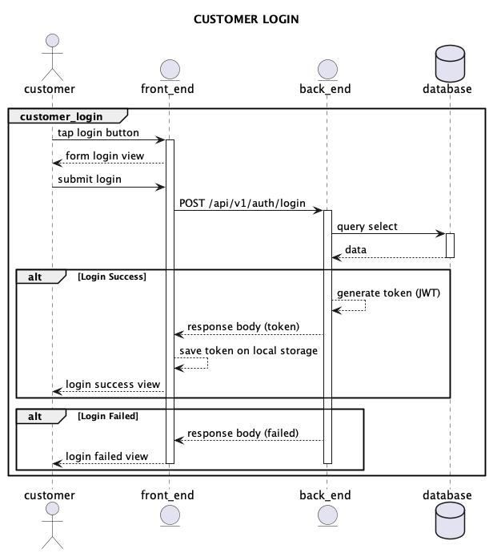

#### Endpoint: POST /api/v1/auth/login

#### Request Header: None

#### Request Body:

```json
{
  "username": "Muhammad Veiron Ramadhan",
  "password": "Pass123*"
}
```

#### Response Body:

```json
{
  "status": true,
  "message": "Login success",
  "data": {
    "token": "05072151-1c79-48de-b1bb-2d5eaf6f1912",
    "expiredAt": 1734404530947
  }
}
```

#### Query (check username & password):

```sql
SELECT customer_id,
       username,
       password_hash
FROM customers
WHERE username = ?
```

### 1.3. Logout

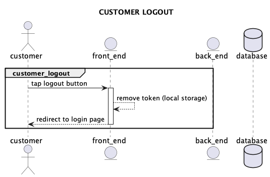

## 2. Customer Product List include Category

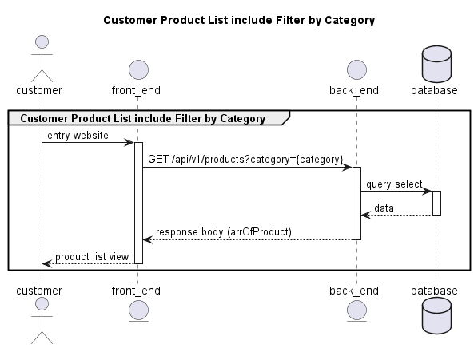

### 2.1. Customer get product

#### Endpoint: GET /api/v1/products?category={category}

#### Request Header:

X-API-TOKEN : Token (mandatory)

#### Request Body:

```json
{
  -
}
```

#### Response Body:

```json
{
  {
  "status": true,
  "message": "Products retrieved successfully",
  "data": [
    {
      "idProduct": "prod-001",
      "name": "Ralph Lauren White Polo Shirt",
      "description": "Classic white polo shirt made from premium cotton.",
      "price": 785000,
      "category": "topWear",
    },
    {
      "idProduct": "prod-002",
      "name": "Uniqlo Slim Fit T-Shirt",
      "description": "Basic slim fit t-shirt for daily wear.",
      "price": 345000,
      "category": "topWear",
    }
  ],
}
}
```

#### Query:

```sql
SELECT
  idProduct,
  name,
  description,
  price,
  category
FROM products
WHERE (:category IS NULL OR category = :category);
```

## 3. Customer Product Details include Favorite

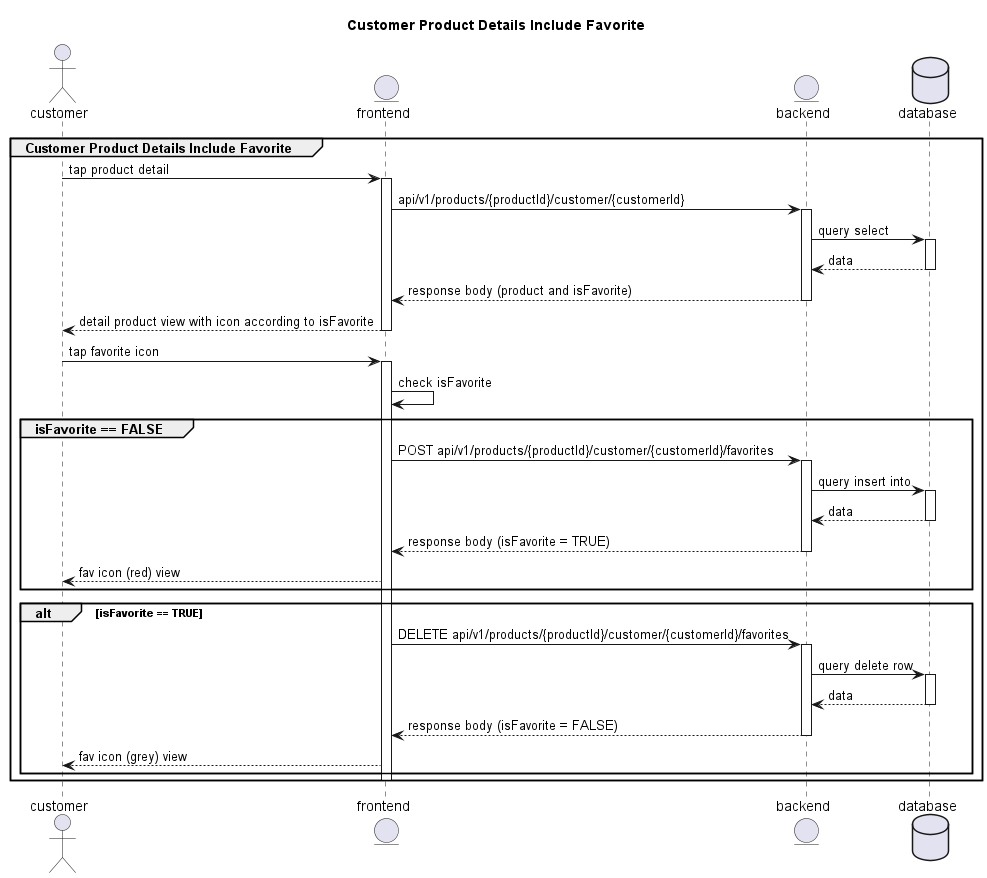

### 3.1. Get product detail information

#### Endpoint: GET /api/v1/products/{productId}/customer/{customerId}

#### Request Header:

X-API-TOKEN : Token (mandatory)

#### Request Body:

```json
{
  -
}
```

#### Response Body:

```json
{
  "status": true,
  "message": "product is favorite for current user",
  "name": "Ralph Lauren White Polo Shirt",
  "description": "A classic white polo shirt by Ralph Lauren, made from premium cotton for a comfortable fit.",
  "price": 785000,
  "category": "topWear",
  "size": "XL",
  "stockQuantity": 17,
  "isFavorite": true
}
```

```json
{
  "status": true,
  "message": "product isn't favorite for current user",
  "name": "Uniqlo Slim Fit T-Shirt",
  "description": "Basic slim fit t-shirt from Uniqlo, ideal for daily wear and layering.",
  "price": 345000,
  "category": "topWear",
  "size": "L",
  "stockQuantity": 23,
  "isFavorite": false
}
```

#### Query:

```sql
SELECT
    p.name,
    p.description,
    p.price,
    p.category,
    s.size,
    s.stockQuantity,
    CASE
        WHEN fp.idFavoriteProduct IS NOT NULL THEN true
        ELSE false
    END AS isFavorite
FROM Product p
JOIN Stock s ON s.idProduct = p.idProduct
LEFT JOIN FavoriteProduct fp
    ON fp.idProduct = p.idProduct AND fp.idCustomer = :customerId
WHERE p.idProduct = :productId
LIMIT 1;
```

### 3.2. add favorite product

#### Endpoint: POST /api/v1/products/{productId}/customer/{customerId}/favorites

#### Request Header:

X-API-TOKEN : Token (mandatory)

#### Request Body:

```json
{
  -
}
```

#### Response Body:

```json
{
  "status": true
  "message": "add to favorite succes"
  "isFavorite": true
}
```

#### Query:

```sql
INSERT INTO FavoriteProduct (idProduct, idCustomer)
VALUES (:productId, :customerId);
```

### 3.1. remove favorite product

#### Endpoint: DELETE /api/v1/products/{productId}/customer/{customerId}/favorites

#### Request Header:

X-API-TOKEN : Token (mandatory)

#### Request Body:

```json
{
  -
}
```

#### Response Body:

```json
{
  "status": true
  "message": "remove from favorite succes"
  "isFavorite": false
}
```

#### Query:

```sql
DELETE FROM FavoriteProduct
WHERE idProduct = :productId AND idCustomer = :customerId;
```

## 4. Customer Cart CRUD

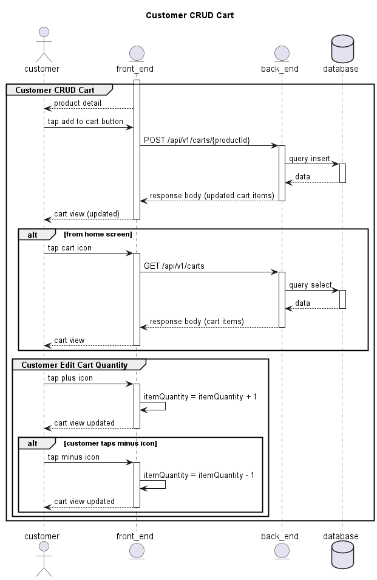

### 4.1. add to product to cart

#### Endpoint: POST /api/v1/carts/{productId}

#### Request Header:

X-API-TOKEN : Token (mandatory)

#### Request Body:

```json
{
  -
}
```

#### Response Body:

```json
{
  "status": true,
  "message": "item successfully added to cart",
  "cartTotalPrice": 1130000
  "data" : [
    {
      {
      "idCartItem": "item-001",
      "name": "Ralph Lauren White Polo Shirt",
      "description": "Classic white polo shirt made from premium cotton.",
      "price": 785000,
      "category": "topWear",
      "itemQuantity": 2
      "stockQuantity":17
    },
    {
      "idCartItem": "item-002",
      "name": "Uniqlo Slim Fit T-Shirt",
      "description": "Basic slim fit t-shirt for daily wear.",
      "price": 345000,
      "category": "topWear",
      "itemQuantity": 1
      "stockQuantity":23
    }
    }

  ]

}
```

#### Query:

```sql
-- Insert a product into the cart with quantity = 1
INSERT INTO cart_items (cart_item_id, user_id, product_id, quantity)
VALUES ('item-002, 'user-123', 'product-002', 1);
```

```sql
SELECT
    ci.cart_item_id AS "idCartItem",
    p.name,
    p.description,
    p.price,
    p.category,
    ci.quantity,
FROM cart_items ci
JOIN products p ON ci.product_id = p.product_id
WHERE ci.user_id = 'user-123';
```

```sql
SELECT
    SUM(p.price * ci.quantity) AS cartTotalPrice
FROM cart_items ci
JOIN products p ON ci.product_id = p.product_id
WHERE ci.user_id = 'user-123';
```

### 4.2. cart information

#### Endpoint: GET /api/v1/carts

#### Request Header:

X-API-TOKEN : Token (mandatory)

#### Request Body:

```json
{
  -
}
```

#### Response Body:

```json
{
  "status": true,
  "message": "cart data successfully fetched",
  "cartTotalPrice": 1130000
  "data" : [
    {
      {
      "idCartItem": "item-001",
      "name": "Ralph Lauren White Polo Shirt",
      "description": "Classic white polo shirt made from premium cotton.",
      "price": 785000,
      "category": "topWear",
      "itemQuantity": 2
      "stockQuantity":17
    },
    {
      "idCartItem": "item-002",
      "name": "Uniqlo Slim Fit T-Shirt",
      "description": "Basic slim fit t-shirt for daily wear.",
      "price": 345000,
      "category": "topWear",
      "itemQuantity": 1
      "stockQuantity":23
    }
    }
  ]
}
```

#### Query:

```sql
SELECT
    ci.cart_item_id AS "idCartItem",
    p.name,
    p.description,
    p.price,
    p.category,
    ci.quantity,
FROM cart_items ci
JOIN products p ON ci.product_id = p.product_id
WHERE ci.user_id = 'user-123';
```

```sql
SELECT
    SUM(p.price * ci.quantity) AS cartTotalPrice
FROM cart_items ci
JOIN products p ON ci.product_id = p.product_id
WHERE ci.user_id = 'user-123';
```

## 5. Customer Checkout Cart and see Transaction History

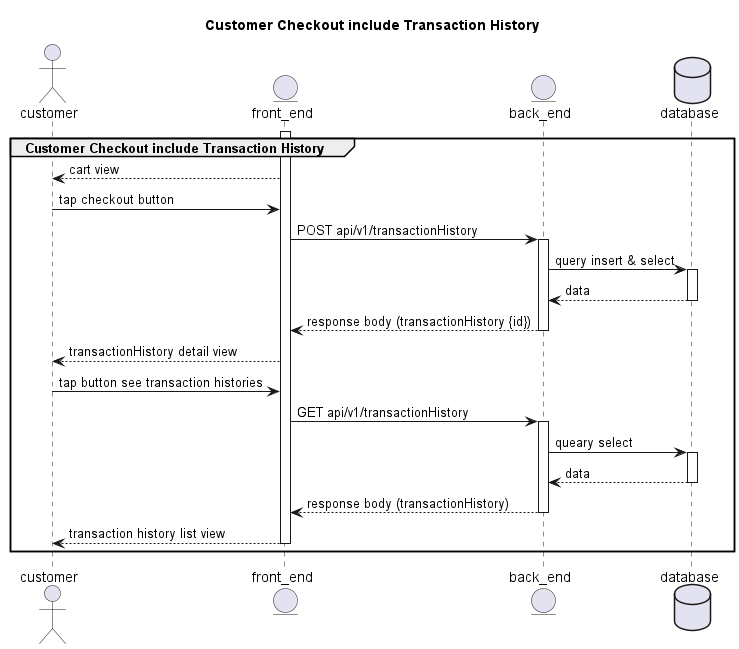

### 5.1. Checkout

#### Endpoint: POST /api/v1/transactionHistory

#### Request Header:

X-API-TOKEN : Token (mandatory)

#### Request Body:

```json
{
  -
}
```

#### Response Body:

```json
{
  "status": true,
  "message": "transaction history succesfully create and new data fetched",
  "totalPrice": 1130000,
  "paymentStatus": false,
  "date": 30-05-2025,
  "data": [
    {
      {
      "idCartItemTemp": "temp-item-001",
      "name": "Ralph Lauren White Polo Shirt",
      "description": "Classic white polo shirt made from premium cotton.",
      "totalPrice": 785000,
      "quantity": 2,
      "size": "XL"
    },
    {
      "idCartItemTemp": "temp-item-002",
      "name": "Uniqlo Slim Fit T-Shirt",
      "description": "Basic slim fit t-shirt for daily wear.",
      "totalPrice": 345000,
      "category": "topWear",
      "quantity": 1,
      "size":"L",
    }
    }
  ]
}
```

#### Query:

```sql
BEGIN;

-- 1) Insert master record into transaction_history
INSERT INTO transaction_history (
    transaction_history_id,
    customer_id,
    total_price,
    created_at
)
VALUES (
    :transactionHistoryId,
    :customerId,
    (
      SELECT SUM(ci.quantity * p.price)
      FROM cart_items ci
      JOIN products     p ON p.product_id = ci.product_id
      WHERE ci.user_id = :customerId
    ),
    NOW()
)
RETURNING transaction_history_id INTO :insertedHistoryId;


-- 2) Insert each cart item as a history line‐item
INSERT INTO transaction_history_items (
    history_item_id,
    transaction_history_id,
    product_id,
    quantity,
    unit_price
)
SELECT
    gen_random_uuid(),           -- or your own ID generator
    :insertedHistoryId,
    ci.product_id,
    ci.quantity,
    p.price
FROM cart_items ci
JOIN products     p  ON p.product_id = ci.product_id
WHERE ci.user_id = :customerId;


-- 3) (Optional) Empty the cart now that it’s been checked out
DELETE FROM cart_items
WHERE user_id = :customerId;


COMMIT;

```

### 5.2. Customer see all his transaction history

#### Endpoint: GET /api/v1/transactionHistory

#### Request Header:

X-API-TOKEN : Token (mandatory)

#### Request Body:

```json
{
  -
}
```

#### Response Body:

```json
{
  "status": true,
  "message": "transaction history successfully created and new data fetched",
  "data": [
    {
      "transactionHistoryId": "transaction-001",
      "totalPrice": 1130000,
      "paymentStatus": false,
      "date": "30-05-2025",
      "itemData": [
        {
          "idCartItemTemp": "temp-item-001",
          "name": "Ralph Lauren White Polo Shirt",
          "description": "Classic white polo shirt made from premium cotton.",
          "totalPrice": 785000,
          "quantity": 2,
          "size": "XL"
        },
        {
          "idCartItemTemp": "temp-item-002",
          "name": "Uniqlo Slim Fit T-Shirt",
          "description": "Basic slim fit t-shirt for daily wear.",
          "totalPrice": 345000,
          "quantity": 1,
          "size": "L"
        }
      ]
    },
    {
      "transactionHistoryId": "transaction-002",
      "totalPrice": 500000,
      "paymentStatus": true,
      "date": "30-05-2025",
      "itemData": [
        {
          "idCartItemTemp": "temp-item-003",
          "name": "Levi’s 501 Original Jeans",
          "description": "Iconic straight-leg denim jeans.",
          "totalPrice": 500000,
          "quantity": 1,
          "size": "M"
        }
      ]
    }
  ]
}
```

#### Query:

```sql
SELECT
  jsonb_build_object(
    'status',      true,
    'message',     'transaction history successfully created and new data fetched',
    'data',
      (
        SELECT jsonb_agg(history_obj)
        FROM (
          -- for each transaction_history record
          SELECT
            th.transaction_history_id   AS "transactionHistoryId",
            th.total_price              AS "totalPrice",
            th.payment_status           AS "paymentStatus",
            to_char(th.created_at, 'DD-MM-YYYY') AS "date",
            (
              -- nested array of itemData
              SELECT jsonb_agg(item_obj)
              FROM (
                SELECT
                  thi.history_item_id                   AS "idCartItemTemp",
                  p.name                                 AS "name",
                  p.description                          AS "description",
                  (thi.unit_price * thi.quantity)        AS "totalPrice",
                  thi.quantity                           AS "quantity",
                  thi.size                               AS "size"
                FROM transaction_history_items thi
                JOIN products                    p  ON p.product_id = thi.product_id
                WHERE thi.transaction_history_id = th.transaction_history_id
              ) AS item_obj
            ) AS "itemData"
          FROM transaction_history th
          WHERE th.customer_id = :customerId
          ORDER BY th.created_at DESC
        ) AS history_obj
      )
  ) AS full_response;

```

## 6. Customer Searh Product

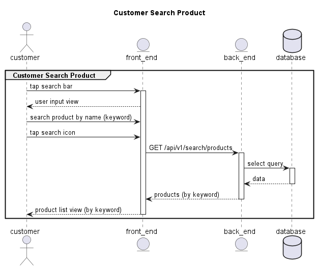

### 6.1. search product

#### Endpoint: GET /api/v1/search/products

#### Request Header:

X-API-TOKEN : Token (mandatory)

#### Request Body:

```json
{
  "keyword": "Shirt"
}
```

```json
{
  "keyword": "Fresh Fish"
}
```

#### Response Body:

```json
{
  "status": "true",
  "message": "berhasil mencari data",
  "data": [
    {
      "idProduct": "prod-001",
      "name": "Ralph Lauren White Polo Shirt",
      "description": "Classic white polo shirt made from premium cotton.",
      "price": 785000,
      "category": "topWear"
    },
    {
      "idProduct": "prod-002",
      "name": "Uniqlo Slim Fit T-Shirt",
      "description": "Basic slim fit t-shirt for daily wear.",
      "price": 345000,
      "category": "topWear"
    }
  ]
}
```

```json
{
  "status": "true",
  "message": "berhasil mencari data",
  "data": []
}
```

#### Query:

```sql
SELECT
  id_product    AS idProduct,
  name,
  description,
  price,
  category
FROM products
WHERE name        LIKE CONCAT('%', :keyword, '%')
   OR description LIKE CONCAT('%', :keyword, '%');

```

# ADMIN

## 1. Admin Authentication

### 1.1. Login

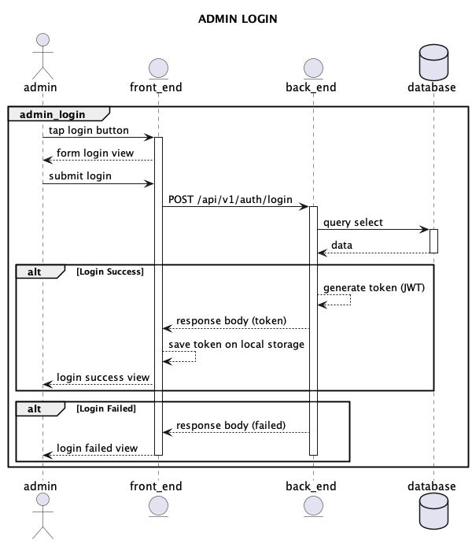

#### Endpoint: POST /api/v1/auth/login

#### Request Header: None

#### Request Body:

```json
{
  "username": "Admin",
  "password": "Admin123*"
}
```

#### Response Body:

```json
{
  "status": true,
  "message": "Login success",
  "data": {
    "token": "05072151-1c79-48de-b1bb-2d5eaf6f1912",
    "expiredAt": 1734404530947
  }
}
```

#### Query (check username & password):

```sql
SELECT customer_id,
       username,
       password_hash
FROM customers
WHERE username = ?
```

### 1.2. Logout

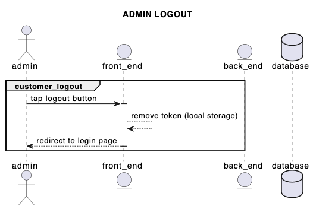

## 2. Admin Product List and Product Detail

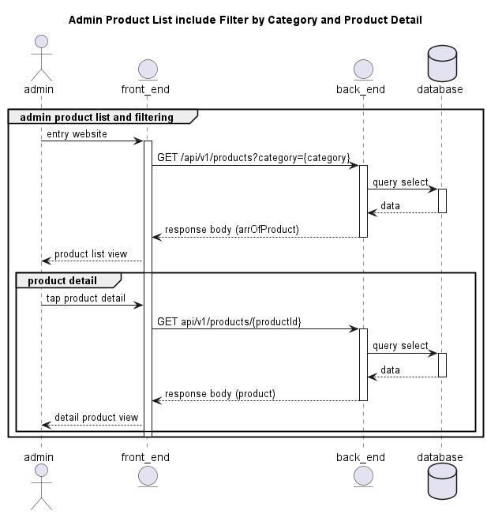

### 2.1. Product List

#### Endpoint: GET /api/products?category={category}

#### Request Header:

X-API-TOKEN : Token (mandatory)

#### Request Body:

```json
{
  -
}
```

#### Response Body:

```json
{
  {
  "status": true,
  "message": "Products retrieved successfully",
  "data": [
    {
      "idProduct": "prod-001",
      "name": "Ralph Lauren White Polo Shirt",
      "description": "Classic white polo shirt made from premium cotton.",
      "price": 785000,
      "category": "topWear",
    },
    {
      "idProduct": "prod-002",
      "name": "Uniqlo Slim Fit T-Shirt",
      "description": "Basic slim fit t-shirt for daily wear.",
      "price": 345000,
      "category": "topWear",
    }
  ],
}
}
```

#### Query:

```sql
SELECT
  idProduct,
  name,
  description,
  price,
  category
FROM products
WHERE (:category IS NULL OR category = :category);
```

### 2.2. product detail

#### Endpoint: GET /api/v1/products/{productId}

#### Request Header:

X-API-TOKEN : Token (mandatory)

#### Request Body:

```json
{
  -
}
```

#### Response Body:

```json
{
  "status": true,
  "message": "product is favorite for current user",
  "name": "Ralph Lauren White Polo Shirt",
  "description": "A classic white polo shirt by Ralph Lauren, made from premium cotton for a comfortable fit.",
  "price": 785000,
  "category": "topWear",
  "size": "XL",
  "stockQuantity": 17
}
```

```json
{
  "status": true,
  "message": "product isn't favorite for current user",
  "name": "Uniqlo Slim Fit T-Shirt",
  "description": "Basic slim fit t-shirt from Uniqlo, ideal for daily wear and layering.",
  "price": 345000,
  "category": "topWear",
  "size": "L",
  "stockQuantity": 23
}
```

#### Query:

```sql
SELECT
  name,
  description,
  price,
  category,
  size,
  stock_quantity
FROM products
WHERE id = :productId;

```

## 3. Admin CRUD Product

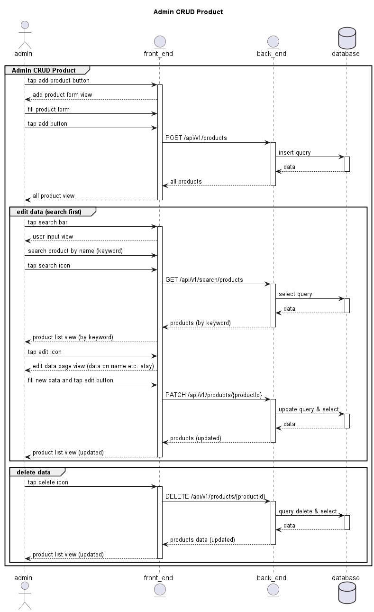

### 3.1. add new product

#### Endpoint: POST /api/v1/products

#### Request Header:

X-API-TOKEN : Token (mandatory)

#### Request Body:

```json
{
  "name": "Ralph Lauren White Polo Shirt",
  "description": "A classic white polo shirt by Ralph Lauren, made from premium cotton for a comfortable fit.",
  "price": 785000,
  "category": "topWear",
  "size": "XL",
  "stockQuantity": 17
}
```

#### Response Body:

```json
{
  {
  "status": true,
  "message": "Products successfully added",
  "data": [
    {
      "idProduct": "prod-001",
      "name": "Ralph Lauren White Polo Shirt",
      "description": "A classic white polo shirt by Ralph Lauren, made from premium cotton for a comfortable fit.",
      "price": 785000,
      "category": "topWear",
      "size": "XL",
      "stockQuantity": 17,
    },
  ],
}
}
```

#### Query:

```sql
INSERT INTO products
    (name,
     description,
     price,
     category,
     size,
     stock_quantity)
VALUES
    ('Ralph Lauren White Polo Shirt',
     'A classic white polo shirt by Ralph Lauren, made from premium cotton for a comfortable fit.',
     785000,
     'topWear',
     'XL',
     17);

```

```sql
SELECT *
FROM products
WHERE id_product = 'prod-001';  -- or use LAST_INSERT_ID() if auto-generated
```

### 3.2. search product

#### Endpoint: GET /api/v1/search/products

#### Request Header:

X-API-TOKEN : Token (mandatory)

#### Request Body:

```json
{
  "keyword": "Shirt"
}
```

```json
{
  "keyword": "Fresh Fish"
}
```

#### Response Body:

```json
{
  "status": "true",
  "message": "berhasil mencari data",
  "data": [
    {
      "idProduct": "prod-001",
      "name": "Ralph Lauren White Polo Shirt",
      "description": "Classic white polo shirt made from premium cotton.",
      "price": 785000,
      "category": "topWear"
      "size": "XL",
      "stockQuantity": 17,
    },
    {
      "idProduct": "prod-002",
      "name": "Uniqlo Slim Fit T-Shirt",
      "description": "Basic slim fit t-shirt for daily wear.",
      "price": 345000,
      "category": "topWear",
      "size": "L",
      "stockQuantity": 23,
    }
  ]
}
```

```json
{
  "status": "true",
  "message": "berhasil mencari data",
  "data": []
}
```

#### Query:

```sql
SELECT
  id_product    AS idProduct,
  name,
  description,
  price,
  category
FROM products
WHERE name        LIKE CONCAT('%', :keyword, '%')
   OR description LIKE CONCAT('%', :keyword, '%');

```

### 3.3. edit product

#### Endpoint: PATCH /api/v1/products/{productId}

#### Request Header:

X-API-TOKEN : Token (mandatory)

#### Request Body:

```json
{
  "name": "Special Edition Ralph Lauren X Louis Vuitton White Polo Shirt",
  "description": "A special white polo shirt by Ralph Lauren X Louis Vuitton, made from premium cotton for a comfortable fit.",
  "price": 16500000,
  "category": "topWear",
  "size": "L",
  "stockQuantity": 2
}
```

#### Response Body:

```json
{
  {
  "status": true,
  "message": "Products successfully edited",
  "data": [
    {
      "idProduct": "prod-001",
      "name": "Special Edition Ralph Lauren X Louis Vuitton White Polo Shirt",
      "description": "A special white polo shirt by Ralph Lauren X Louis Vuitton, made from premium cotton for a comfortable fit.",
      "price": 16500000,
      "category": "topWear",
      "size": "L",
      "stockQuantity": 2,
    },
    {
      "idProduct": "prod-002",
      "name": "Uniqlo Slim Fit T-Shirt",
      "description": "Basic slim fit t-shirt for daily wear.",
      "price": 345000,
      "category": "topWear"
      "size": "L",
      "stockQuantity": 23,
    },
  ],
}
}
```

#### Query:

```sql
UPDATE products
SET
  name           = :name,
  description    = :description,
  price          = :price,
  category       = :category,
  size           = :size,
  stock_quantity = :stockQuantity
WHERE id_product   = :productId;

```

```sql
SELECT
  id_product    AS idProduct,
  name,
  description,
  price,
  category,
  size,
  stock_quantity AS stockQuantity
FROM products;

```

### 3.4. delete product

#### Endpoint: DELETE /api/v1/products/{productId}

#### Request Header:

X-API-TOKEN : Token (mandatory)

#### Request Body:

```json
{
  -
}
```

#### Response Body:

```json
{
  {
  "status": true,
  "message": "Products successfully deleted",
  "data": [
    {
      "idProduct": "prod-002",
      "name": "Uniqlo Slim Fit T-Shirt",
      "description": "Basic slim fit t-shirt for daily wear.",
      "price": 345000,
      "category": "topWear",
      "size": "L",
      "stockQuantity": 23,
    },
  ],
}
}
```

#### Query:

```sql
DELETE FROM products
WHERE id_product = :productId;
```

```sql
SELECT
  id_product      AS idProduct,
  name,
  description,
  price,
  category,
  size,
  stock_quantity AS stockQuantity
FROM products;
```
