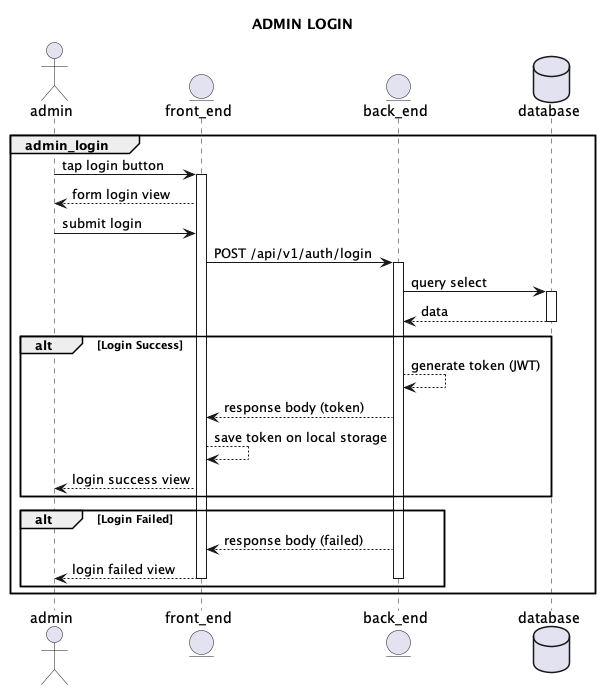
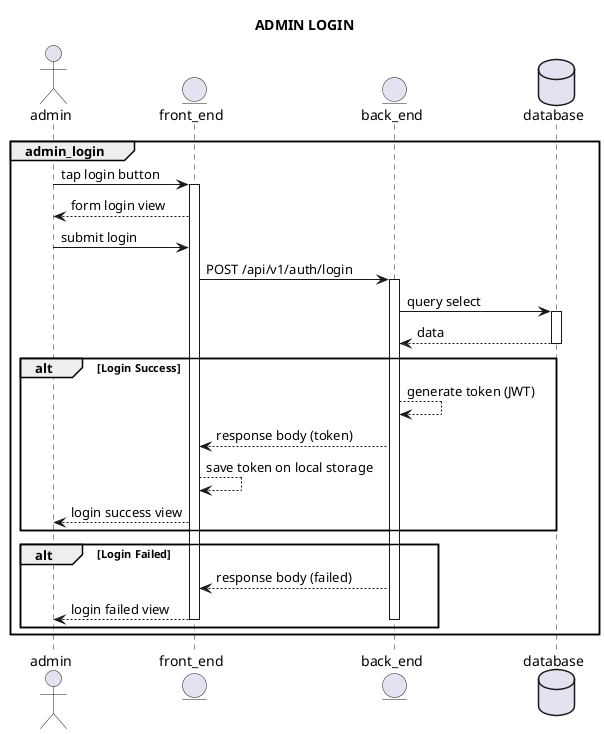
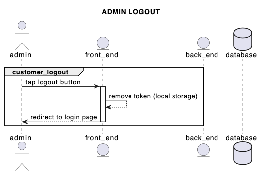
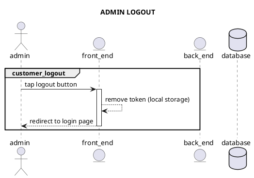

```plantuml
@startuml
title ADMIN LOGIN
Actor admin
Entity front_end
entity back_end
Database database

group admin_login

admin -> front_end: tap login button
activate front_end
    front_end --> admin: form login view
    admin -> front_end: submit login
front_end -> back_end: POST /api/v1/auth/login
activate back_end
back_end -> database: query select
activate database
    database --> back_end: data
deactivate database
    alt Login Success
        back_end --> back_end: generate token (JWT)
        back_end --> front_end: response body (token)
        front_end --> front_end : save token on local storage
        front_end --> admin: login success view
    end alt

    alt Login Failed
        back_end --> front_end: response body (failed)
        front_end --> admin: login failed view
        deactivate front_end
        deactivate back_end
    end alt
end group
@enduml
```

```plantuml
@startuml
title ADMIN LOGOUT
Actor admin
Entity front_end
Entity back_end
Database database

group customer_logout

admin -> front_end: tap logout button
activate front_end
    front_end --> front_end: remove token (local storage)
    front_end --> admin: redirect to login page
deactivate front_end
end group
@enduml
```
