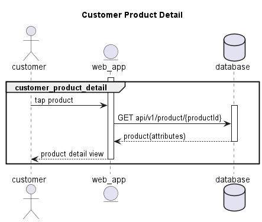
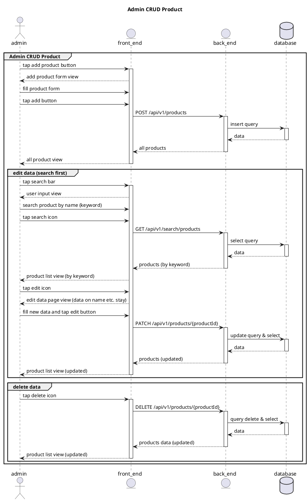

```plantuml
@startuml
title Admin CRUD Product
actor admin
entity front_end
entity back_end
database database

group Admin CRUD Product
admin -> front_end:tap add product button
activate front_end
    front_end --> admin: add product form view
    admin -> front_end: fill product form
    admin -> front_end: tap add button
    front_end -> back_end: POST /api/v1/products
    activate back_end
        back_end -> database: insert query
        activate database
            database --> back_end: data
        deactivate database
        back_end --> front_end: all products
    deactivate back_end
    front_end --> admin: all product view
    deactivate front_end


group edit data (search first)
admin -> front_end: tap search bar
activate front_end
    front_end --> admin: user input view
    admin -> front_end: search product by name (keyword)
    admin -> front_end: tap search icon
    front_end -> back_end: GET /api/v1/search/products
        activate back_end
            back_end -> database: select query

        activate database
            database --> back_end: data
        deactivate database
         back_end --> front_end: products (by keyword)
    deactivate back_end
front_end --> admin: product list view (by keyword)
admin -> front_end: tap edit icon
front_end -->admin: edit data page view (data on name etc. stay)
admin -> front_end: fill new data and tap edit button
front_end -> back_end: PATCH /api/v1/products/{productId}
activate back_end
    back_end -> database: update query & select
    activate database
        database --> back_end: data
    deactivate database
    back_end --> front_end: products (updated)
deactivate back_end
front_end --> admin: product list view (updated)
deactivate front_end
end group
group delete data
admin->front_end: tap delete icon
activate front_end
    front_end -> back_end: DELETE /api/v1/products/{productId}
    activate back_end
        back_end -> database: query delete & select
        activate database
            database --> back_end: data
        deactivate database
        back_end --> front_end: products data (updated)
    deactivate back_end
    front_end --> admin: product list view (updated)
deactivate front_end
end group
end group
@enduml
```
