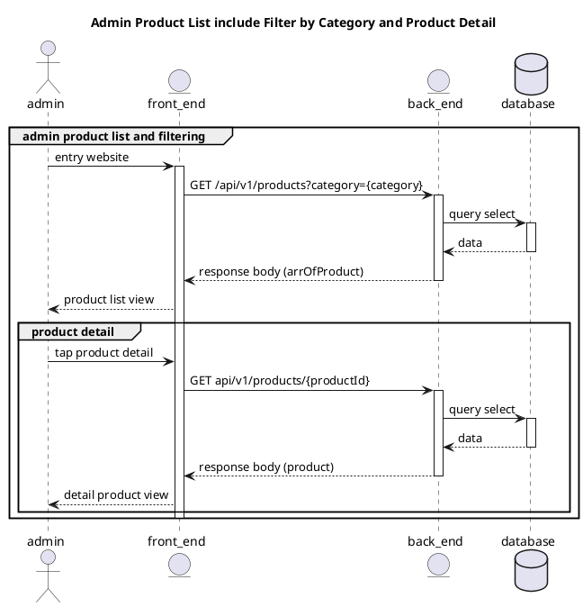

```plantuml
@startuml
title Admin Product List include Filter by Category and Product Detail
actor admin
entity front_end
entity back_end
database database


group admin product list and filtering
admin -> front_end: entry website
activate front_end
    front_end -> back_end: GET /api/v1/products?category={category}
    activate back_end
        back_end -> database: query select
        activate database
            database --> back_end: data
        deactivate database
        back_end --> front_end: response body (arrOfProduct)
    deactivate back_end
    front_end --> admin: product list view
group product detail
admin -> front_end : tap product detail
    front_end -> back_end : GET api/v1/products/{productId}
        activate back_end
            back_end -> database : query select
                activate database
                    database --> back_end : data
                deactivate database
            back_end --> front_end : response body (product)
        deactivate back_end
    front_end --> admin : detail product view

end group
deactivate front_end

end group
@enduml

```
