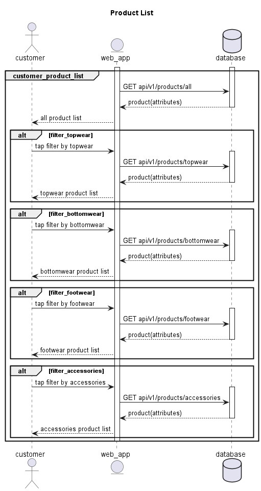
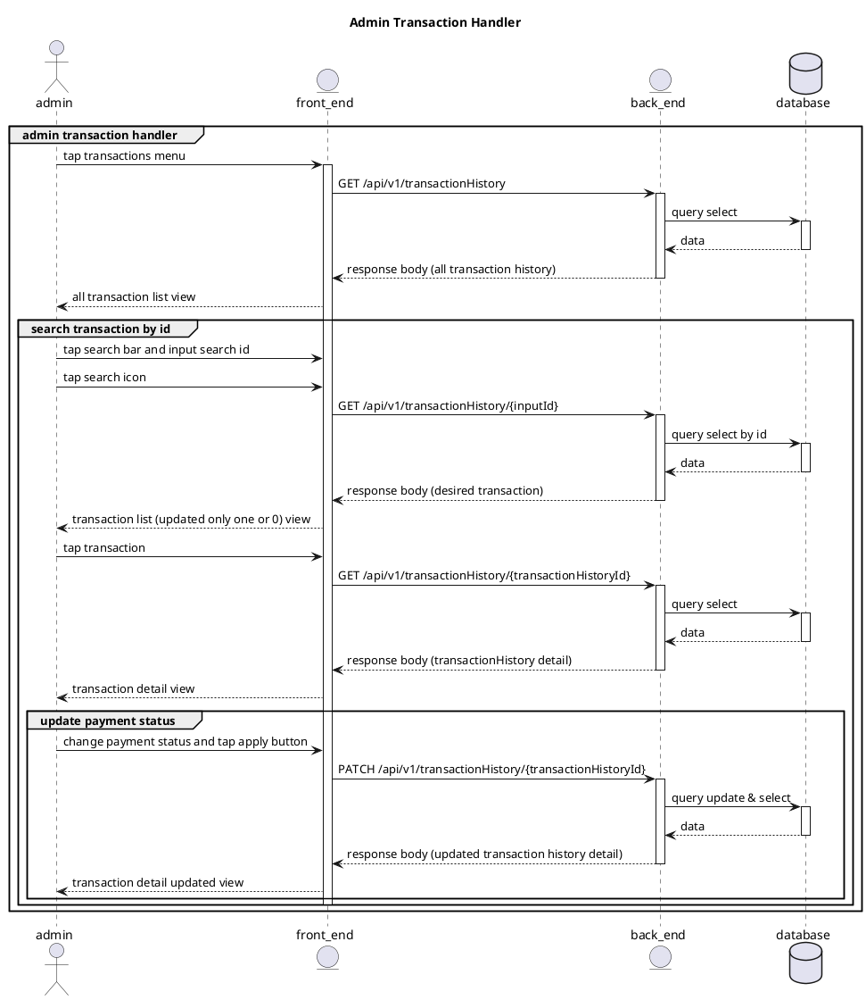

```plantuml
@startuml
title Admin Transaction Handler
actor admin
entity front_end
entity back_end
database database


group admin transaction handler
    admin -> front_end: tap transactions menu
    activate front_end
        front_end -> back_end: GET /api/v1/transactionHistory
        activate back_end
            back_end -> database: query select
            activate database
                database --> back_end: data
            deactivate database
            back_end --> front_end: response body (all transaction history)
        deactivate back_end
        front_end --> admin: all transaction list view
        group search transaction by id
        admin -> front_end: tap search bar and input search id
        admin -> front_end: tap search icon

            front_end -> back_end: GET /api/v1/transactionHistory/{inputId}
            activate back_end
                back_end -> database: query select by id
                activate database
                    database --> back_end: data
                deactivate database
                back_end --> front_end: response body (desired transaction)
            deactivate back_end
            front_end --> admin: transaction list (updated only one or 0) view
            admin -> front_end: tap transaction
            front_end -> back_end: GET /api/v1/transactionHistory/{transactionHistoryId}
            activate back_end
                back_end -> database: query select
                activate database
                    database --> back_end: data
                deactivate database
                back_end --> front_end: response body (transactionHistory detail)
            deactivate back_end
            front_end --> admin: transaction detail view
            group update payment status
                admin -> front_end: change payment status and tap apply button
                front_end -> back_end: PATCH /api/v1/transactionHistory/{transactionHistoryId}
                activate back_end
                    back_end -> database: query update & select
                    activate database
                        database --> back_end: data
                    deactivate database
                    back_end --> front_end: response body (updated transaction history detail)
                deactivate back_end
                front_end --> admin: transaction detail updated view
            end group
        deactivate front_end
        end group
    deactivate front_end


end group
@enduml


```
