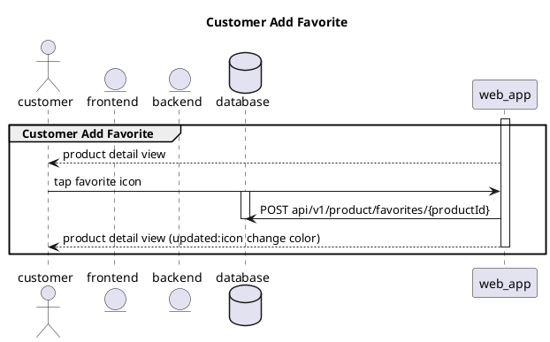

```plantuml
@startuml
title Customer Add Favorite
Actor customer
Entity frontend
Entity backend
Database database

group Customer Add Favorite
activate web_app
    web_app --> customer:product detail view
    customer -> web_app:tap favorite icon
    activate database
        web_app -> database:POST api/v1/product/favorites/{productId}
    deactivate database
    web_app --> customer:product detail view (updated:icon change color)
deactivate web_app

end group
@enduml
```
