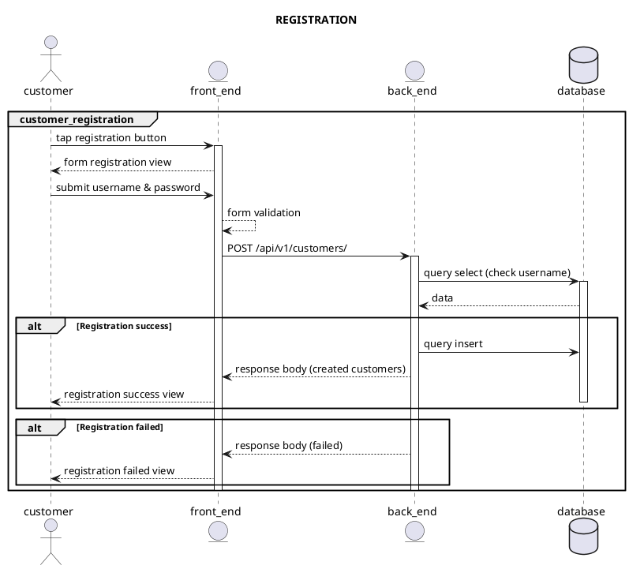
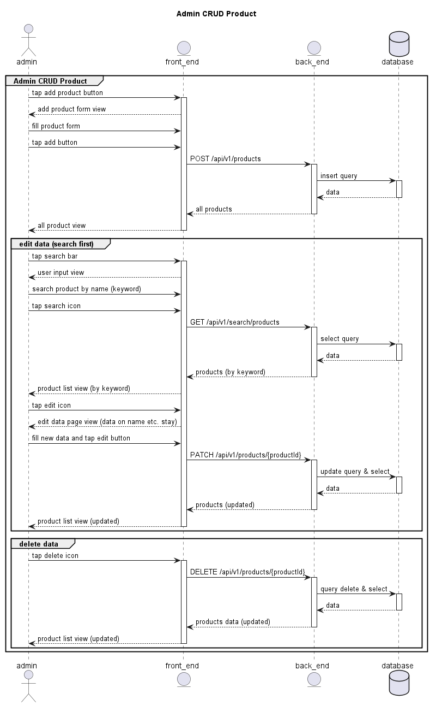
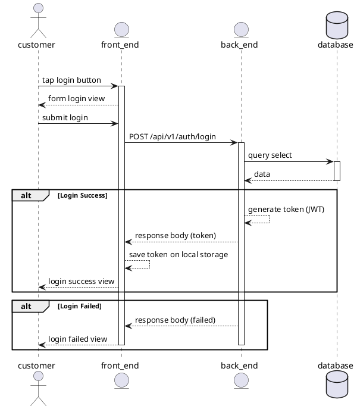
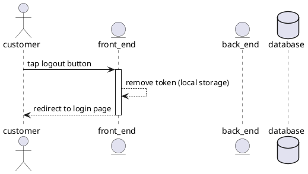

```plantuml
@startuml
title REGISTRATION
Actor customer
Entity front_end
Entity back_end
Database database

group customer_registration

customer -> front_end: tap registration button
activate front_end
    front_end --> customer: form registration view
    customer -> front_end: submit username & password
    front_end --> front_end: form validation
    front_end -> back_end: POST /api/v1/customers/
activate back_end
    back_end -> database: query select (check username)
activate database
    database --> back_end: data
    alt Registration success
        back_end -> database: query insert
        back_end --> front_end: response body (created customers)
        front_end --> customer: registration success view
deactivate database
    end alt
    alt Registration failed
        back_end --> front_end: response body (failed)
        front_end --> customer: registration failed view
    end alt
deactivate front_end
deactivate back_end
end group
@enduml
```

```plantuml
@startuml
Actor customer
Entity front_end
Entity back_end
Database database

group customer_login

customer -> front_end: tap login button
activate front_end
    front_end --> customer: form login view
    customer -> front_end: submit login
front_end -> back_end: POST /api/v1/auth/login
activate back_end
back_end -> database: query select
activate database
    database --> back_end: data
deactivate database
    alt Login Success
        back_end --> back_end: generate token (JWT)
        back_end --> front_end: response body (token)
        front_end --> front_end : save token on local storage
        front_end --> customer: login success view
    end alt

    alt Login Failed
        back_end --> front_end: response body (failed)
        front_end --> customer: login failed view
        deactivate front_end
        deactivate back_end
    end alt
@enduml
```

```plantuml
@startuml
Actor customer
Entity front_end
Entity back_end
Database database

customer -> front_end: tap logout button
activate front_end
    front_end --> front_end: remove token (local storage)
    front_end --> customer: redirect to login page
deactivate front_end
@enduml
```
