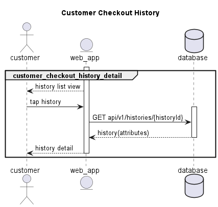
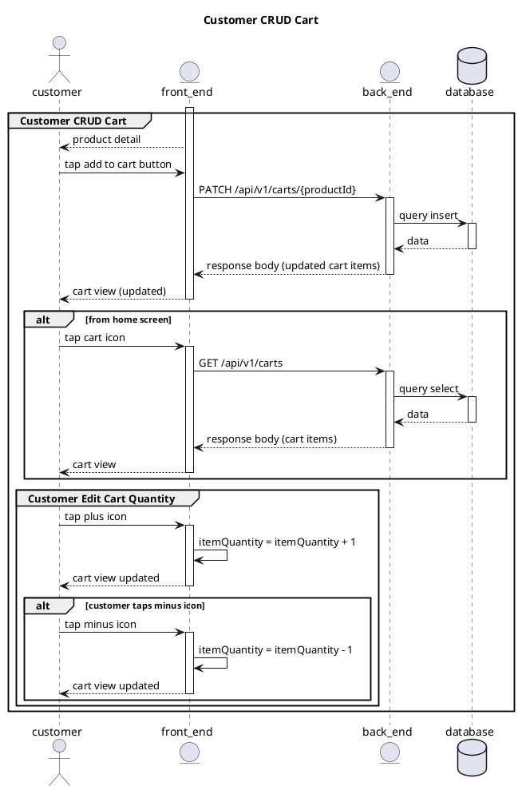

```plantuml
@startuml
title Customer CRUD Cart

actor customer
entity front_end
entity back_end
database database

group Customer CRUD Cart

  activate front_end
  front_end --> customer : product detail
  customer -> front_end : tap add to cart button
    front_end -> back_end : PATCH /api/v1/carts/{productId}
    activate back_end
      back_end -> database : query insert
      activate database
        database --> back_end : data
      deactivate database
      back_end --> front_end : response body (updated cart items)
    deactivate back_end
    front_end --> customer : cart view (updated)
  deactivate front_end

  alt from home screen
    customer -> front_end : tap cart icon
    activate front_end
      front_end -> back_end : GET /api/v1/carts
      activate back_end
        back_end -> database : query select
        activate database
          database --> back_end : data
        deactivate database
        back_end --> front_end : response body (cart items)
      deactivate back_end
      front_end --> customer : cart view
    deactivate front_end
  end alt

  group Customer Edit Cart Quantity
    customer -> front_end : tap plus icon
    activate front_end
        front_end -> front_end : itemQuantity = itemQuantity + 1
        front_end --> customer : cart view updated
    deactivate front_end

    alt customer taps minus icon
      customer -> front_end : tap minus icon
      activate front_end
        front_end -> front_end : itemQuantity = itemQuantity - 1
        front_end --> customer : cart view updated
    deactivate front_end
    end alt
  end group
end group
@enduml

```
