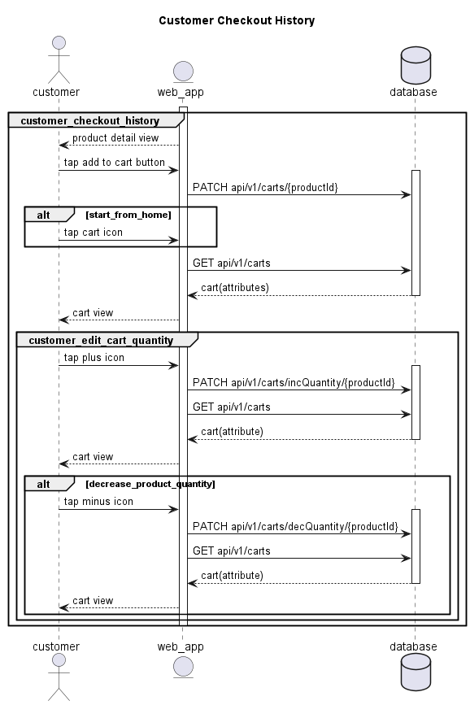
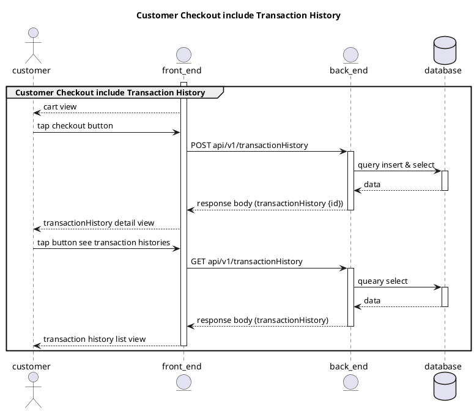

```plantuml
@startuml
title Customer Checkout include Transaction History
actor customer
entity front_end
entity back_end
database database

group Customer Checkout include Transaction History
activate front_end
    front_end --> customer:cart view
    customer -> front_end:tap checkout button
        front_end -> back_end:POST api/v1/transactionHistory
        activate back_end
        back_end -> database: query insert & select
        activate database
            database --> back_end: data
        deactivate database
        back_end --> front_end: response body (transactionHistory {id})
    deactivate back_end
    front_end --> customer:transactionHistory detail view
    customer -> front_end : tap button see transaction histories
    front_end -> back_end: GET api/v1/transactionHistory
    activate back_end
        back_end -> database: queary select
        activate database
            database --> back_end: data
        deactivate database
        back_end --> front_end: response body (transactionHistory)
    deactivate back_end
    front_end --> customer: transaction history list view
deactivate front_end
end group
@enduml

```
