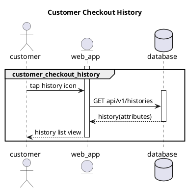

```plantuml
@startuml
title Customer Checkout History
Actor customer
Entity web_app
Database database

group customer_checkout_history
activate web_app
    customer -> web_app:tap history icon
    activate database
        web_app -> database:GET api/v1/histories
        database --> web_app: history(attributes)
    deactivate database
    web_app --> customer:history list view
deactivate web_app

end group
@enduml

```
