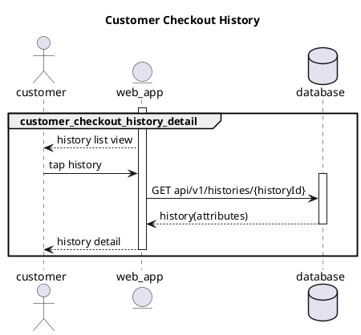

```plantuml
@startuml
title Customer Checkout History
Actor customer
Entity web_app
Database database

group customer_checkout_history_detail
activate web_app
    web_app-->customer:history list view
    customer -> web_app:tap history
    activate database
        web_app -> database:GET api/v1/histories/{historyId}
        database --> web_app: history(attributes)
    deactivate database
    web_app --> customer:history detail
deactivate web_app

end group
@enduml
```
