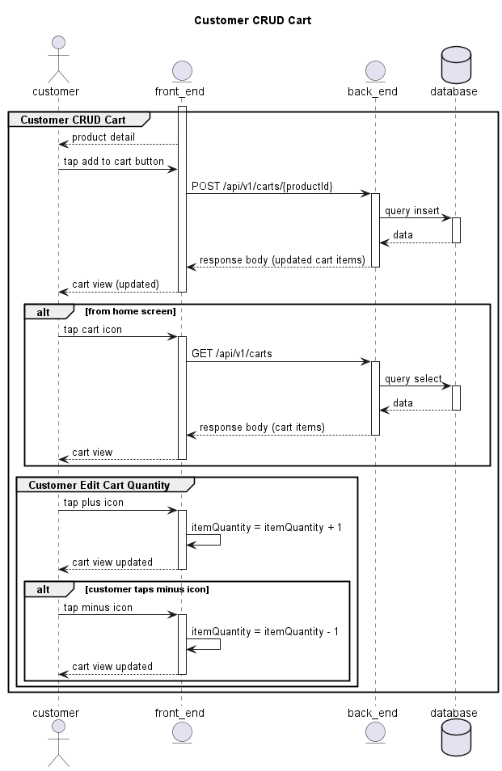
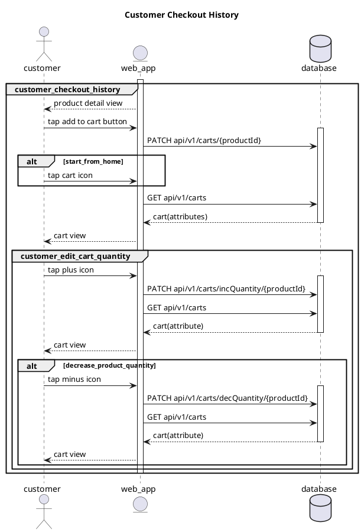

```plantuml
@startuml
title Customer Checkout History
Actor customer
Entity web_app
Database database

group customer_checkout_history
activate web_app
    web_app --> customer:product detail view
    customer -> web_app:tap add to cart button

    activate database
        web_app -> database:PATCH api/v1/carts/{productId}
        alt start_from_home
            customer -> web_app:tap cart icon
        end alt
        web_app -> database:GET api/v1/carts
        database --> web_app: cart(attributes)
    deactivate database
    web_app --> customer:cart view
    group customer_edit_cart_quantity
        customer -> web_app:tap plus icon
        activate database
            web_app -> database:PATCH api/v1/carts/incQuantity/{productId}
            web_app -> database:GET api/v1/carts
            database --> web_app:cart(attribute)
        deactivate database
        web_app --> customer:cart view
        alt decrease_product_quantity
            customer -> web_app:tap minus icon
        activate database
            web_app -> database:PATCH api/v1/carts/decQuantity/{productId}
            web_app -> database:GET api/v1/carts
            database --> web_app:cart(attribute)
        deactivate database
        web_app --> customer:cart view
        end alt
    end group
deactivate web_app

end group
@enduml
```
