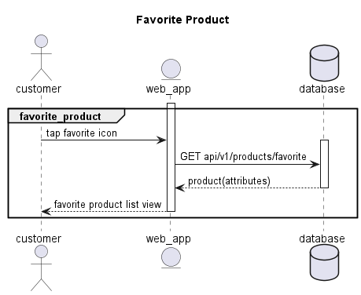
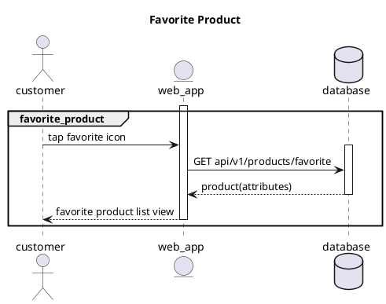

```plantuml

@startuml
title Favorite Product
Actor customer
Entity web_app
Database database

group favorite_product
activate web_app
    customer -> web_app:tap favorite icon
    activate database
        web_app -> database:GET api/v1/products/favorite
        database --> web_app: product(attributes)
    deactivate database
    web_app --> customer:favorite product list view
deactivate web_app

end group
@enduml
```
