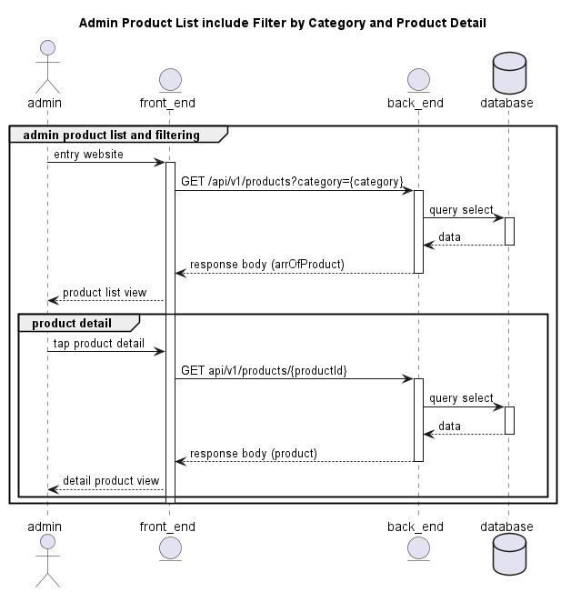
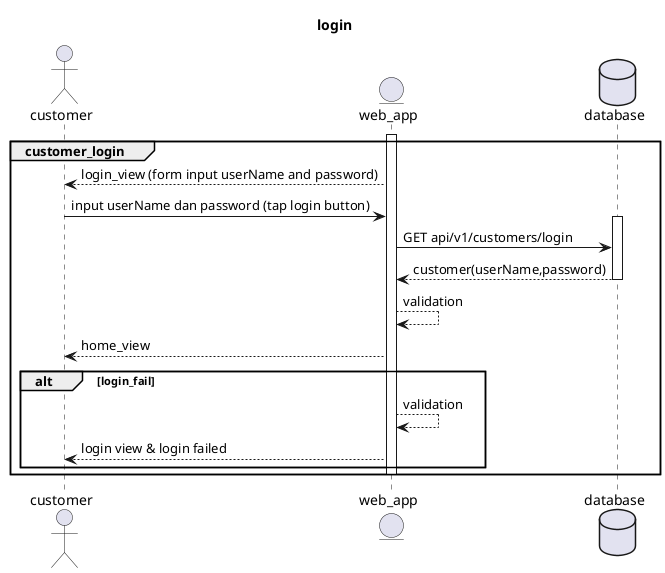

```plantuml
@startuml
title login
Actor customer
Entity web_app
Database database

group customer_login
activate web_app
    web_app -->customer:login_view (form input userName and password)
    customer -> web_app:input userName dan password (tap login button)
        activate database
            web_app -> database:GET api/v1/customers/login
            database --> web_app:customer(userName,password)
        deactivate database
        web_app --> web_app:validation
        web_app --> customer:home_view
        alt login_fail
            web_app --> web_app:validation
            web_app -->customer:login view & login failed
        end alt

deactivate web_app

end group
@enduml
```
