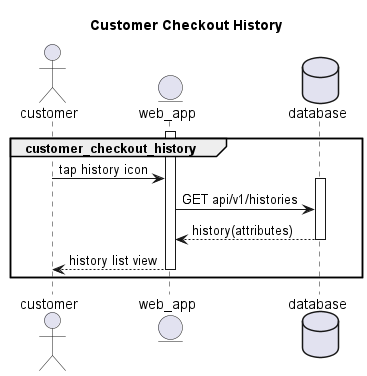
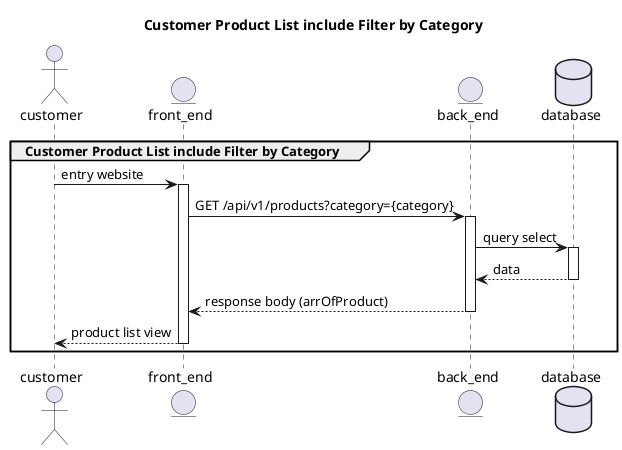

```plantuml
@startuml
title Customer Product List include Filter by Category
actor customer
entity front_end
entity back_end
database database


group Customer Product List include Filter by Category
customer -> front_end: entry website
activate front_end
    front_end -> back_end: GET /api/v1/products?category={category}
    activate back_end
        back_end -> database: query select
        activate database
            database --> back_end: data
        deactivate database
        back_end --> front_end: response body (arrOfProduct)
    deactivate back_end
    front_end --> customer: product list view
deactivate front_end

end group
@enduml

```
