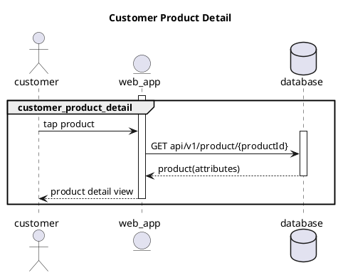

```plantuml
@startuml
title Customer Product Detail
Actor customer
Entity web_app
Database database

group customer_product_detail
activate web_app
    customer -> web_app:tap product
    activate database
        web_app -> database:GET api/v1/product/{productId}
        database --> web_app: product(attributes)
    deactivate database
    web_app --> customer:product detail view
deactivate web_app

end group
@enduml
```
