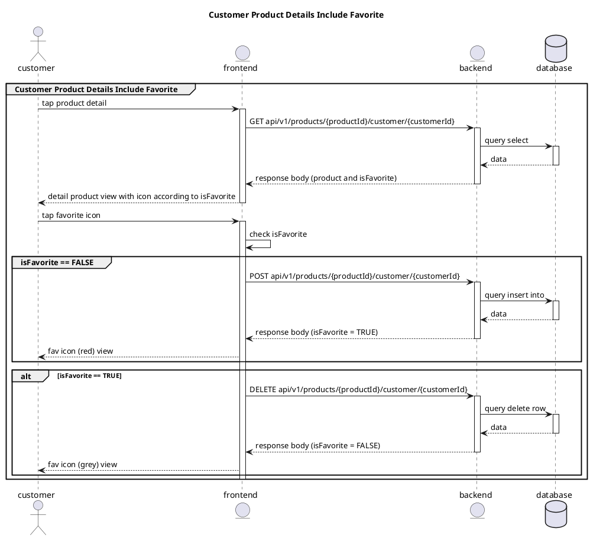

```plantuml

@startuml
title Customer Product Details Include Favorite

actor customer
entity frontend
entity backend
database database

group Customer Product Details Include Favorite
  customer -> frontend : tap product detail
  activate frontend
    frontend -> backend : GET api/v1/products/{productId}/customer/{customerId}
        activate backend
            backend -> database : query select
                activate database
                    database --> backend : data
                deactivate database
            backend --> frontend : response body (product and isFavorite)
        deactivate backend
    frontend --> customer : detail product view with icon according to isFavorite
  deactivate frontend
  customer -> frontend : tap favorite icon
  activate frontend
    frontend -> frontend : check isFavorite
    group isFavorite == FALSE
    frontend -> backend : POST api/v1/products/{productId}/customer/{customerId}
        activate backend
             backend -> database : query insert into
             activate database
                database --> backend : data
             deactivate database
             backend --> frontend : response body (isFavorite = TRUE)
        deactivate backend
        frontend --> customer : fav icon (red) view
    end group
    alt isFavorite == TRUE
        frontend -> backend : DELETE api/v1/products/{productId}/customer/{customerId}
        activate backend
            backend -> database : query delete row
            activate database
                database --> backend : data
            deactivate database
            backend --> frontend : response body (isFavorite = FALSE)
        deactivate backend
        frontend --> customer : fav icon (grey) view
    end alt
  deactivate frontend
end group

@enduml

```
