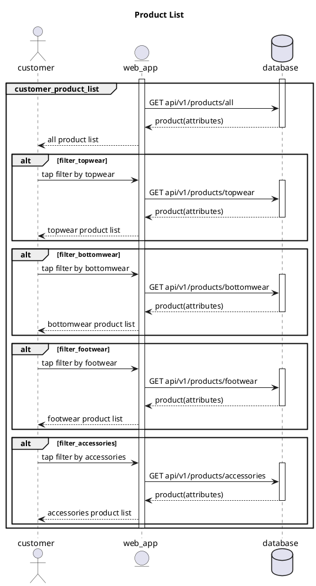

```plantuml
@startuml
title Product List
Actor customer
Entity web_app
Database database

group customer_product_list
activate web_app
    activate database
        web_app -> database:GET api/v1/products/all
        database --> web_app: product(attributes)
    deactivate database
    web_app --> customer:all product list
    alt filter_topwear
        customer -> web_app:tap filter by topwear
        activate database
        web_app -> database:GET api/v1/products/topwear
        database --> web_app: product(attributes)
    deactivate database
    web_app --> customer:topwear product list
    end alt
    alt filter_bottomwear
        customer -> web_app:tap filter by bottomwear
        activate database
        web_app -> database:GET api/v1/products/bottomwear
        database --> web_app: product(attributes)
    deactivate database
    web_app --> customer:bottomwear product list
    end alt
    alt filter_footwear
        customer -> web_app:tap filter by footwear
        activate database
        web_app -> database:GET api/v1/products/footwear
        database --> web_app: product(attributes)
    deactivate database
    web_app --> customer:footwear product list
    end alt
    alt filter_accessories
        customer -> web_app:tap filter by accessories
        activate database
        web_app -> database:GET api/v1/products/accessories
        database --> web_app: product(attributes)
    deactivate database
    web_app --> customer:accessories product list
    end alt
deactivate web_app

end group
@enduml
```
