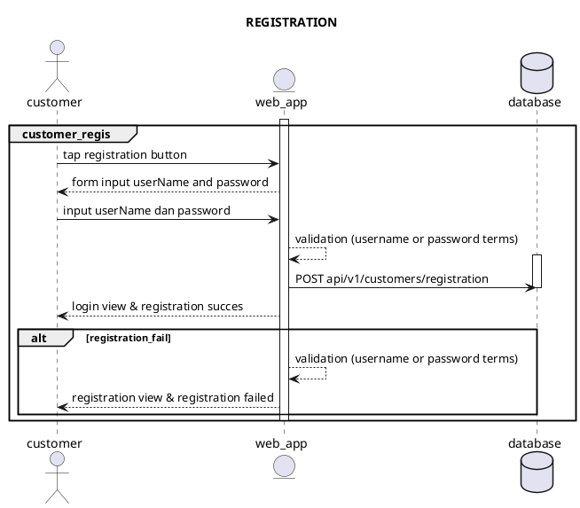

```plantuml
@startuml
title REGISTRATION
Actor customer
Database customer
Entity web_app
Database database

group customer_regis
activate web_app
    customer -> web_app: tap registration button

            web_app -->customer:form input userName and password
            customer -> web_app:input userName dan password
            web_app --> web_app:validation (username or password terms)
            activate database
            web_app -> database: POST api/v1/customers/registration
            deactivate database
            web_app --> customer: login view & registration succes
                alt registration_fail
                    web_app --> web_app:validation (username or password terms)
                    web_app -->customer:registration view & registration failed
                end alt

deactivate web_app

end group
@enduml
```
