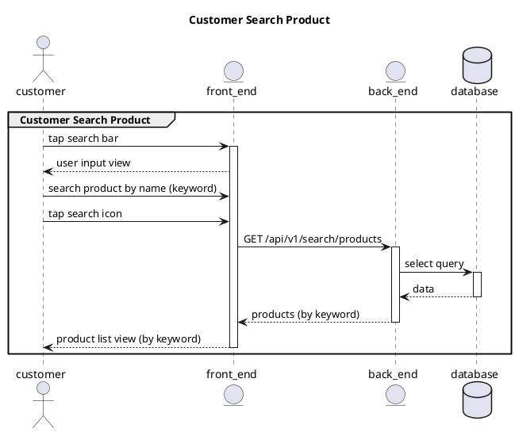

```plantuml
@startuml
title Customer Search Product
actor customer
entity front_end
entity back_end
database database

group Customer Search Product
customer -> front_end: tap search bar
activate front_end
    front_end --> customer: user input view
    customer -> front_end: search product by name (keyword)
    customer -> front_end: tap search icon
    front_end -> back_end: GET /api/v1/search/products
        activate back_end
            back_end -> database: select query

        activate database
            database --> back_end: data
        deactivate database
         back_end --> front_end: products (by keyword)
    deactivate back_end
front_end --> customer: product list view (by keyword)

deactivate front_end
end group
@enduml

```
